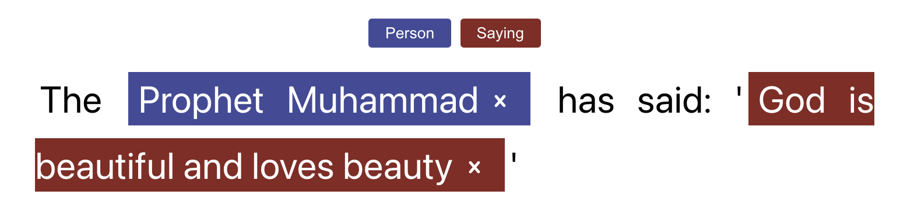

# Annotato: annotating and adding interactivity to texts via a React hook



Annotato is a React component that helps to annotate or merely display previously made annotations in a given text. All edits, and thus new annotations, are stored in the component state that can be acquired via the useAnnotato hook. Possible use cases for this exported data is the creation of training data for Machine Learning or re-use within Annotato in order to create an enhanced text reading experience.

There are two distinct modes in Annotato: read and edit. The read mode allows for prior stored annotations to appear in a given text without edit functionality. The edit mode, however, does display an additional label selector toolbar and allows for new annotations to be made as well as previous annotations to be removed. New annotations are made by highlighting some text and then clicking on the desired label in the label toolbar.
Both modes support custom onClick and onHover events for annotations.

## Bridging the gap: data analytics and HTML

Texts can be analyzed in various ways and certain facts can be assessed about texts. For example, one could assess that a snippet of text contains a quotation by Shakespeare between character 10 and 55. The question then arises, how can this fact become visualized on a webpage? One option is to use a library like BeautifulSoup in order to enclose the earlier mentioned citation within a specific HTML tag. However, it becomes very difficult to read this data via an API and display it in an idiomaticly React way (not to mention the need to use dangerouslySetInnerHTML(yuck!)).  Moreover, the annotations become interwoven with the text itself via certain tags. Would it not be better to have these facts become recorded separately from the text itself. For example,

```
text model: {
    id: "someId",
    content: "This is a long page from a book that contains this citation from Shakespeare: Love all, trust a few, do wrong to none".
}
```

```
annotation model: {
    id: "someId",
    labelId: "Shakespeare citation",
    startOffset: 78,
    endOffset: 119
}
```

The latter model would allow for multiple concurrent facts about texts being recorded without having multiple nested tags as in the case with other solutions.

## Install

```npm install --save annotato```

## Getting Started

```js
import React from 'react';
import useAnnotato from 'annotato/hooks/useAnnotato';

const dummyText = "This is a text that will be annotated.";

const dummyAnnotations = [{
    id: "someId",
    labelId: "test",
    startOffset: 0,
    endOffset: 4
}];

const dummyLabels = [
  {
    id: "test",
    color: "#444999",
  }
];

function View() {
  const [Annotato, annotations] = useAnnotato({
    mode: "edit",
    text: dummyText,
    annotations: dummyAnnotations,
    labels: dummyLabels,
    onClick: (annotation, e) => console.log("CLICK", annotation, e),
    onMouseEnter: (annotation, e) => console.log("HOVER", annotation, e),
  });

  return (
    <div className="App">
      <div style={{ maxWidth: "50%", textAlign: "justify", margin: "0 auto" }}>
        <Annotato />
        <button
          onClick={() => {
            console.log(annotations);
          }}
        >
          Click
        </button>
      </div>
    </div>
  );
}
```

## API

### useAnnotato hook
| Method      | Arguments | Return                                |
|-------------|-----------|---------------------------------------|
| useAnnotato | config    | [Widget React component, annotations] |


### config

| param                | value                                                                                                                                                                                                                                  | required |
|----------------------|----------------------------------------------------------------------------------------------------------------------------------------------------------------------------------------------------------------------------------------|----------|
| mode                 | "read" or "edit"                                                                                                                                                                                                                       | true     |
| annotations          | array of [{   id: string;   labelId: string;   startOffset: number;   endOffset: number; }]                                                                                                                                            | false    |
| labels               | array of [{   id: string;   color: string; }]                                                                                                                                                                                          | false    |
| text                 | string to be annotated                                                                                                                                                                                                                 | true     |
| removeAnnotationIcon | React element that defines a custom annotation  remove icon (by default this is a simple x icon)                                                                                                                                       | false    |
| onClick              | (annotation, event) => {}; this event will be fired on click and the  first argument will contain the selected annotation whereas the second argument will contain the MouseEvent (to get the .clientX or clientY values for example). | false    |
| onMouseEnter         | (annotation, event) => {}; this event will be fired on hover and the  first argument will contain the selected annotation whereas the second argument will contain the MouseEvent (to get the .clientX or clientY values for example). | false    |

## Custom Styling

All important elements have been provided with a classname via the BEM format. For example, the main container has a classname ```.annotato__container```. These classnames can be discovered with the browser inspect tools.